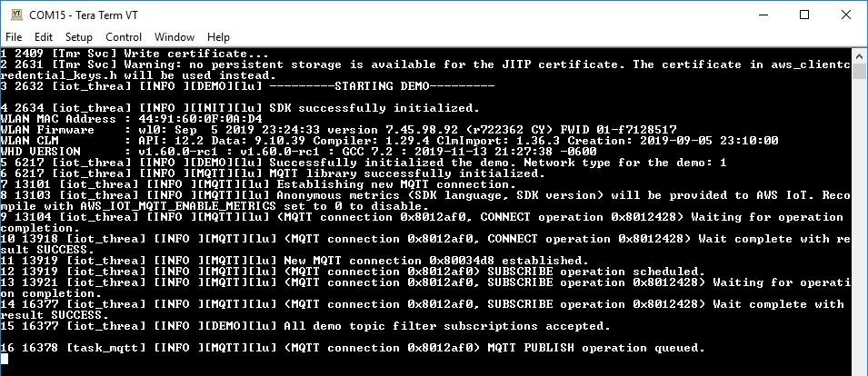

# Amazon FreeRTOS Example: CapSense

This code example shows implementing capacitive touch sensing using CapSense® and ModusToolbox™ Amazon FreeRTOS SDK. This example features a 5-segment CapSense slider and two CapSense buttons. The status of the buttons and slider are stored in an AWS Thing shadow. The same publishing device also subscribes to the shadow updates and controls the kit LED when an update is received. Button 0 turns the LED ON, Button 1 turns the LED OFF, and the slider controls the brightness of the LED. The code example also features interfacing with Tuner GUI using I2C interface.

## Requirements

- [ModusToolbox™ IDE](https://www.cypress.com/products/modustoolbox-software-environment) v2.0
- [ModusToolbox Amazon FreeRTOS SDK](https://github.com/cypresssemiconductorco/amazon-freertos)
- [Cypress Programmer](https://www.cypress.com/products/psoc-programming-solutions)
- Programming Language: C
- Associated Parts: All [PSoC® 6 MCU](http://www.cypress.com/PSoC6) parts with Amazon FreeRTOS support

## Supported Kits

- [PSoC 6 Wi-Fi BT Prototyping Kit](https://www.cypress.com/CY8CPROTO-062-4343W) (CY8CPROTO-062-4343W) - Default target
- [PSoC 6 Wi-Fi-BT Pioneer Kit](https://www.cypress.com/CY8CKIT-062-WiFi-BT) (CY8CKIT-062-WiFi-BT)

## Hardware Setup

This example uses the board's default configuration. See the kit user guide to ensure the board is configured correctly.

**Note**: The PSoC 6 BLE Pioneer Kit and the PSoC 6 WiFi-BT Pioneer Kit ship with KitProg2 installed. ModusToolbox software requires KitProg3. Before using this code example, make sure that the board is upgraded to KitProg3. The tool and instructions are available in the [Firmware Loader](https://github.com/cypresssemiconductorco/Firmware-loader) GitHub repository. If you do not upgrade, you will see an error like "unable to find CMSIS-DAP device" or "KitProg firmware is out of date".

## Software Setup

Install a terminal emulator if you don't have one. Instructions in this document use [Tera Term](https://ttssh2.osdn.jp/index.html.en).

## Using the Code Example

### First Steps:

1. Clone Amazon FreeRTOS from [GitHub](https://github.com/cypresssemiconductorco/amazon-freertos) and checkout the latest release using its tag. Following command also clones all the submodules.

   ```
   git clone --recurse-submodules https://github.com/cypresssemiconductorco/amazon-freertos.git --branch 201910-MTBAFR1951
   ```

2. Go to *\<amazon-freertos>/projects/cypress* folder. 

   **Note:** *\<amazon-freertos>* refers to the path of the Amazon FreeRTOS folder in your computer. 

3. Clone or download this code example, or copy it if you already have it.

   ```
   git clone https://github.com/cypresssemiconductorco/afr-example-capsense.git
   ```
4. Create a Thing named **capsense**. Open *\<amazon-freertos>/demos/include/aws_clientcredential.h* file and configure the SSID, Wi-Fi password of the desired network, and AWS parameters such as endpoint and Thing name.

5. Configure the client certificate and the private key in *\<amazon-freertos>/demos/include/aws_clientcredential_keys.h* for the Thing used in step 4.

6. Connect the kit to your PC using the provided USB cable through the USB connector.

7. Open a terminal program and select the KitProg3 COM port. Set the serial port parameters to 8N1 and 115200 baud.

### Using ModusToolbox IDE:

1. Go to **File > Import**.
2. Choose **Existing Projects into Workspace** under **General** and click **Next**. 
3. Click the **Browse** button near **Select root directory**, choose the CE folder *\<amazon-freertos>/projects/cypress/afr-example-capsense*, and click **Finish**. 
4. Select the application project in the Project Explorer.
5. In the **Quick Panel**, scroll down, and click **afr-example-capsense Program (KitProg3)**.

To program a target board different from the default one defined using the TARGET variable in the Makefile, you need to generate the launch configurations for the new target. See [Running Amazon FreeRTOS Code Examples - KBA228845](https://www.cypress.com/KBA228845) for details. 

### Using Command-line Interface (CLI):

1. Open a CLI terminal and navigate to the CE folder. 

2. From the terminal, execute the `make program` command to build and program the application using the default toolchain to the default target. You can specify a target and toolchain manually:

   ```
   make program TARGET=<BSP> TOOLCHAIN=<toolchain>
   ```
   Example:

   ```
   make program TARGET=CY8CPROTO-062-4343W TOOLCHAIN=GCC_ARM
   ```

### Using CMake:

1. Create a build folder (e.g., *cmake_build*) under *\<amazon-freertos>/build*.

2. Run the following command from the build folder:

   ```
   cmake -G Ninja -S ../.. -B . -DVENDOR=cypress -DCOMPILER=arm-gcc -DBOARD=CY8CPROTO_062_4343W -DAPP=projects/cypress/afr-example-capsense
   ```


3. Once CMake has generated the configuration, run the following command:

   ```
   cmake --build .
   ```

4. Use [Cypress Programmer](https://www.cypress.com/products/psoc-programming-solutions) to program the *afr-example-capsense.elf* file generated under *\<amazon-freertos>/build/cmake_build*.

## Operation

1. After programming, the application starts automatically. On the termainal window, a startup screen showing Wi-Fi connection details should appear. The device performs an MQTT GET query at the start-up to get the initial shadow state.

##### Figure 1. Startup Screen  


2. If the AWS thing had a shadow state, confirm that user LED is at that state. If the AWS thing shadow is empty, confirm that the user LED glows at max brightness.
3. Now, touch Button 1 to turn the LED OFF, touch Button 0 to turn the LED ON, and touch the slider in different positions to change the brightness when LED is ON.
4. For monitoring CapSense data, CapSense parameter tuning and SNR measurement, see [CapSense Tuner Guide](https://www.cypress.com/ModusToolboxCapSenseTuner). See [AN85951 – PSoC 4 and PSoC 6 MCU CapSense Design Guide](https://www.cypress.com/an85951) for more details on selecting the right tuning parameters. 

## Debugging

You can debug the example to step through the code. In the ModusToolbox IDE, use the **afr-example-capsense Debug (KitProg3)** configuration in the **Quick Panel**. See [Debugging a PSoC 6 MCU ModusToolbox Project - KBA224621](https://community.cypress.com/docs/DOC-15763) for details.

## Design and Implementation

In this project, PSoC 6 MCU scans a self-capacitance (CSD) based 5-elements CapSense slider and two mutual capacitance (CSX) based CapSense buttons for user input. The project uses the CapSense middleware. See [AN85951 – PSoC 4 and PSoC 6 MCU CapSense Design Guide](https://www.cypress.com/an85951) for more details of CapSense features and usage. Based on the user input, the LED state is controlled. A PWM HAL resource is configured for controlling the brightness of the LED.

For step-by-step instructions on configuring CapSense, see [ModusToolbox CapSense Configurator Guide](https://www.cypress.com/ModusToolboxCapSenseConfig). You can launch the CapSense Configurator tool from the Quick Panel in ModusToolbox IDE.
The configuration file that the tool works with is located at *\<amazon-freertos>/vendors/cypress/boards/<kit_name>/aws_demos/application_code/cy_code* directory and in the same directory, the configuration source files (cycfg_capsense.c/.h) are created under GeneratedSource directory.

**Note:** CapSense middleware is located at *\<amazon-freertos>/vendors/cypress/psoc6/mw/capsense*. See the README at the [GitHub repo](https://github.com/cypresssemiconductorco/capsense) for API documentation.

**Threads and their operations:**

1. CapSense task: Initializes the CapSense Hardware block, processes the touch input, and sends a command to the MQTT task.
2. MQTT task: This thread publishes the status of the CapSense button and slider to a AWS Thing shadow. The same thread also subscribes to its own shadow update and reflects the state of the shadow on the user LED.

A FreeRTOS-based timer is used for making the CapSense scan periodic; a queue is used for communication between the CapSense task and MQTT task.

#### 1.8 V Operation
The application is by default configured to work with 3.3 V. If you want to work with 1.8 V, open the Device Configurator tool from the Quick Panel, update the operating conditions as shown in [Figure 1](#figure-1-power-setting-to-work-with-1.8-v), and change the jumper/switch setting as listed in [Table 1](#table-1-jumper/switch-position-for-1.8-V-operation). 

##### Figure 1. Power Setting to Work with 1.8 V


##### Table 1. Jumper/Switch Position for 1.8 V Operation

| Kit                 | Jumper/Switch Position         |
|:--------------------|--------------------------------|
| CY8CPROTO-062-4343W | J3 (1-2)                       |
| CY8CKIT-062-WIFI-BT | SW5 (1-2)                      |

### Related Resources

| Application Notes                                            |                                                              |
| :----------------------------------------------------------- | :----------------------------------------------------------- |
| [AN221774](https://www.cypress.com/AN221774) – Getting Started with PSoC 6 MCU on PSoC Creator | Describes PSoC 6 MCU devices and how to build your first application with PSoC Creator |
| [AN228571](https://www.cypress.com/AN228571) – Getting Started with PSoC 6 MCU on ModusToolbox | Describes PSoC 6 MCU devices and how to build your first application with ModusToolbox |
| [AN210781](https://www.cypress.com/AN210781) – Getting Started with PSoC 6 MCU with Bluetooth Low Energy (BLE) Connectivity on PSoC Creator | Describes PSoC 6 MCU with BLE Connectivity devices and how to build your first application with PSoC Creator |
| [AN215656](https://www.cypress.com/AN215656) – PSoC 6 MCU: Dual-CPU System Design | Describes the dual-CPU architecture in PSoC 6 MCU, and shows how to build a simple dual-CPU design |
| **Code Examples**                                            |                                                              |
| [Using ModusToolbox IDE](https://github.com/cypresssemiconductorco/Code-Examples-for-ModusToolbox-Software) | [Using PSoC Creator](https://www.cypress.com/documentation/code-examples/psoc-6-mcu-code-examples) |
| **Device Documentation**                                     |                                                              |
| [PSoC 6 MCU Datasheets](https://www.cypress.com/search/all?f[0]=meta_type%3Atechnical_documents&f[1]=resource_meta_type%3A575&f[2]=field_related_products%3A114026) | [PSoC 6 Technical Reference Manuals](https://www.cypress.com/search/all/PSoC%206%20Technical%20Reference%20Manual?f[0]=meta_type%3Atechnical_documents&f[1]=resource_meta_type%3A583) |
| **Development Kits**                                         | Buy at Cypress.com                                     |
| [CY8CKIT-062-BLE](https://www.cypress.com/CY8CKIT-062-BLE) PSoC 6 BLE Pioneer Kit | [CY8CKIT-062-WiFi-BT](https://www.cypress.com/CY8CKIT-062-WiFi-BT) PSoC 6 WiFi-BT Pioneer Kit |
| [CY8CPROTO-063-BLE](https://www.cypress.com/CY8CPROTO-063-BLE) PSoC 6 BLE Prototyping Kit | [CY8CPROTO-062-4343W](https://www.cypress.com/cy8cproto-062-4343w) PSoC 6 Wi-Fi BT Prototyping Kit |
| [CY8CKIT-062S2-43012](https://www.cypress.com/CY8CKIT-062S2-43012) PSoC 62S2 Wi-Fi BT Pioneer Kit | |
| **Libraries**                                                |                |
| Cypress Hardware Abstraction Layer Library and docs          | [psoc6hal](https://github.com/cypresssemiconductorco/psoc6hal) on GitHub |
| RetargetIO - Library for redirecting low level IO commands to allow sending messages via standard printf/scanf functions over a UART connection | [retarget-io](https://github.com/cypresssemiconductorco/retarget-io) on GitHub |
| **Middleware**                                               |                                                              |
| CapSense library and docs                                    | [capsense](https://github.com/cypresssemiconductorco/capsense) on GitHub |
| Links to all PSoC 6 Middleware                               | [psoc6-middleware](https://github.com/cypresssemiconductorco/psoc6-middleware) on GitHub |
| **Tools**                                                    |                                                              |
| [ModusToolbox IDE](https://www.cypress.com/modustoolbox)     | The Cypress IDE for PSoC 6 and IoT designers                 |
| [PSoC Creator](https://www.cypress.com/products/psoc-creator-integrated-design-environment-ide) | The Cypress IDE for PSoC and FM0+ development                |

#### Other Resources

Cypress provides a wealth of data at www.cypress.com to help you to select the right device, and quickly and effectively integrate the device into your design.

For the PSoC 6 MCU devices, see [KBA223067](https://community.cypress.com/docs/DOC-14644) in the Cypress community for a comprehensive list of PSoC 6 MCU resources.

### Document History

Document Title: CE229142 - Amazon FreeRTOS Example: CapSense

| Version | Description of Change                                        |
| ------- | ------------------------------------------------------------ |
| 1.0     | New code example.<br>Tested with Amazon FreeRTOS release 201910.00. |

------
All other trademarks or registered trademarks referenced herein are the property of their respective owners.


-------------------------------------------------------------------------------

© Cypress Semiconductor Corporation, 2019. This document is the property of Cypress Semiconductor Corporation and its subsidiaries ("Cypress"). This document, including any software or firmware included or referenced in this document ("Software"), is owned by Cypress under the intellectual property laws and treaties of the United States and other countries worldwide. Cypress reserves all rights under such laws and treaties and does not, except as specifically stated in this paragraph, grant any license under its patents, copyrights, trademarks, or other intellectual property rights. If the Software is not accompanied by a license agreement and you do not otherwise have a written agreement with Cypress governing the use of the Software, then Cypress hereby grants you a personal, non-exclusive, nontransferable license (without the right to sublicense) (1) under its copyright rights in the Software (a) for Software provided in source code form, to modify and reproduce the Software solely for use with Cypress hardware products, only internally within your organization, and (b) to distribute the Software in binary code form externally to end users (either directly or indirectly through resellers and distributors), solely for use on Cypress hardware product units, and (2) under those claims of Cypress's patents that are infringed by the Software (as provided by Cypress, unmodified) to make, use, distribute, and import the Software solely for use with Cypress hardware products. Any other use, reproduction, modification, translation, or compilation of the Software is prohibited.  
TO THE EXTENT PERMITTED BY APPLICABLE LAW, CYPRESS MAKES NO WARRANTY OF ANY KIND, EXPRESS OR IMPLIED, WITH REGARD TO THIS DOCUMENT OR ANY SOFTWARE OR ACCOMPANYING HARDWARE, INCLUDING, BUT NOT LIMITED TO, THE IMPLIED WARRANTIES OF MERCHANTABILITY AND FITNESS FOR A PARTICULAR PURPOSE. No computing device can be absolutely secure. Therefore, despite security measures implemented in Cypress hardware or software products, Cypress shall have no liability arising out of any security breach, such as unauthorized access to or use of a Cypress product. CYPRESS DOES NOT REPRESENT, WARRANT, OR GUARANTEE THAT CYPRESS PRODUCTS, OR SYSTEMS CREATED USING CYPRESS PRODUCTS, WILL BE FREE FROM CORRUPTION, ATTACK, VIRUSES, INTERFERENCE, HACKING, DATA LOSS OR THEFT, OR OTHER SECURITY INTRUSION (collectively, "Security Breach"). Cypress disclaims any liability relating to any Security Breach, and you shall and hereby do release Cypress from any claim, damage, or other liability arising from any Security Breach. In addition, the products described in these materials may contain design defects or errors known as errata which may cause the product to deviate from published specifications. To the extent permitted by applicable law, Cypress reserves the right to make changes to this document without further notice. Cypress does not assume any liability arising out of the application or use of any product or circuit described in this document. Any information provided in this document, including any sample design information or programming code, is provided only for reference purposes. It is the responsibility of the user of this document to properly design, program, and test the functionality and safety of any application made of this information and any resulting product. "High-Risk Device" means any device or system whose failure could cause personal injury, death, or property damage. Examples of High-Risk Devices are weapons, nuclear installations, surgical implants, and other medical devices. "Critical Component" means any component of a High-Risk Device whose failure to perform can be reasonably expected to cause, directly or indirectly, the failure of the High-Risk Device, or to affect its safety or effectiveness. Cypress is not liable, in whole or in part, and you shall and hereby do release Cypress from any claim, damage, or other liability arising from any use of a Cypress product as a Critical Component in a High-Risk Device. You shall indemnify and hold Cypress, its directors, officers, employees, agents, affiliates, distributors, and assigns harmless from and against all claims, costs, damages, and expenses, arising out of any claim, including claims for product liability, personal injury or death, or property damage arising from any use of a Cypress product as a Critical Component in a High-Risk Device. Cypress products are not intended or authorized for use as a Critical Component in any High-Risk Device except to the limited extent that (i) Cypress's published data sheet for the product explicitly states Cypress has qualified the product for use in a specific High-Risk Device, or (ii) Cypress has given you advance written authorization to use the product as a Critical Component in the specific High-Risk Device and you have signed a separate indemnification agreement.  
Cypress, the Cypress logo, Spansion, the Spansion logo, and combinations thereof, WICED, PSoC, CapSense, EZ-USB, F-RAM, and Traveo are trademarks or registered trademarks of Cypress in the United States and other countries. For a more complete list of Cypress trademarks, visit cypress.com. Other names and brands may be claimed as property of their respective owners.
